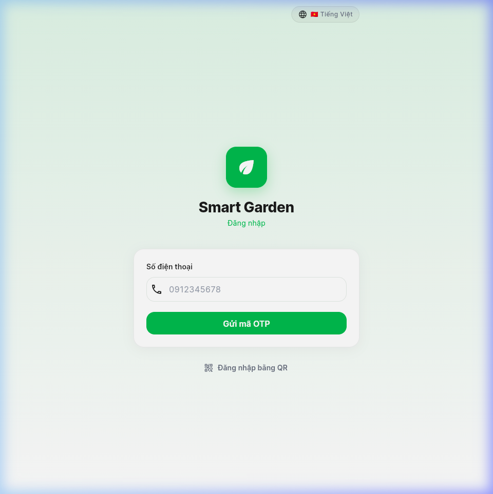
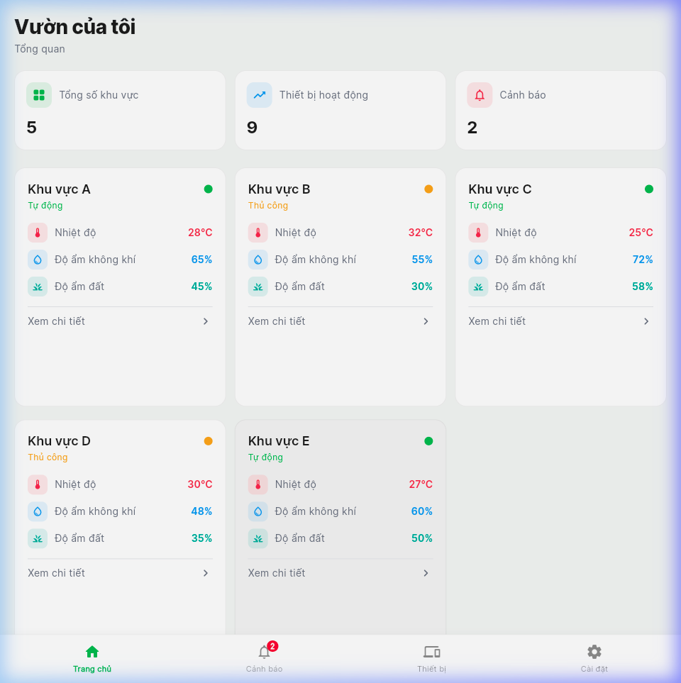
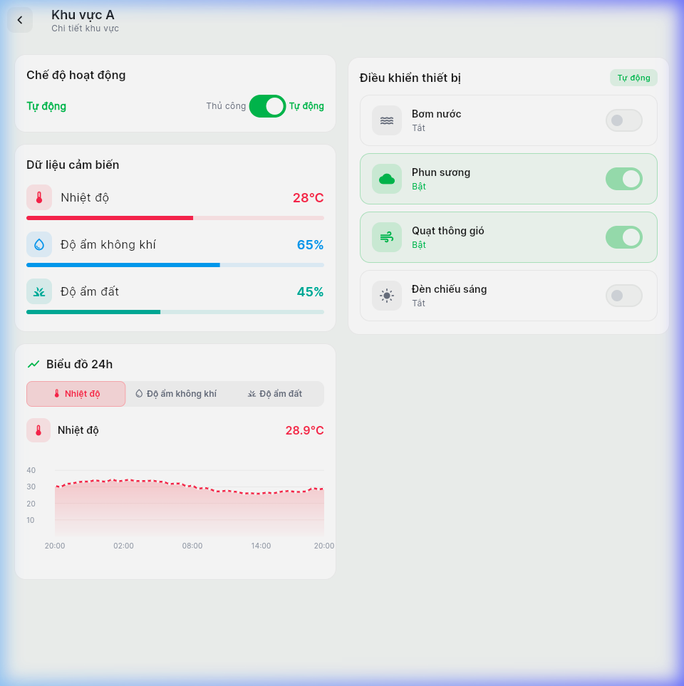
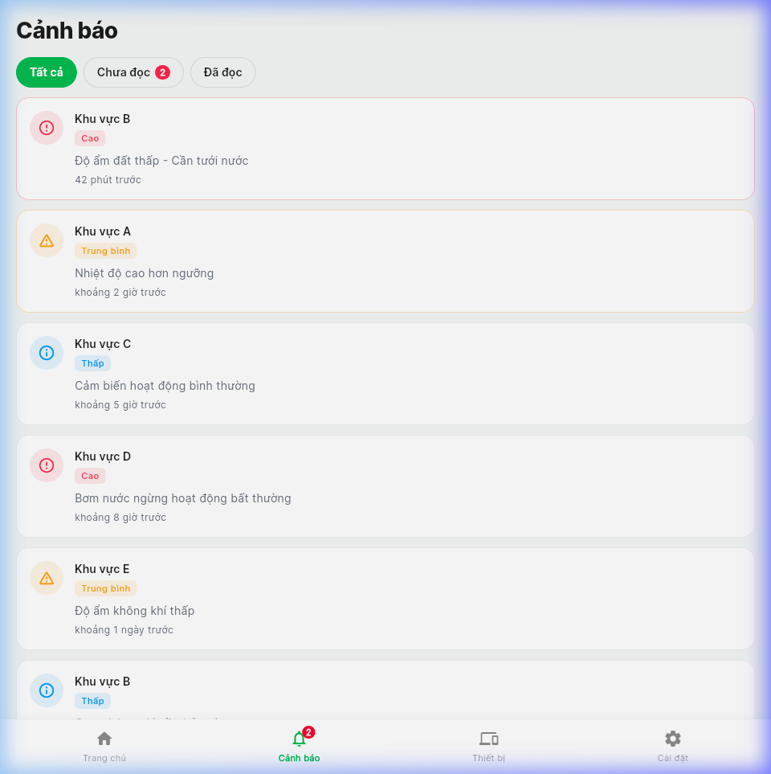
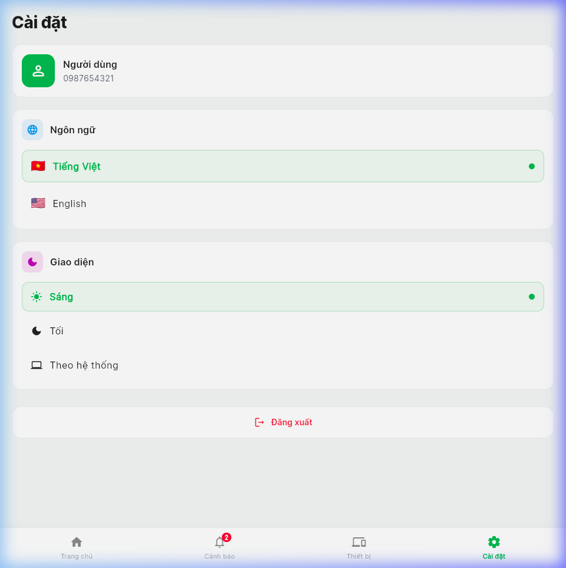

# 🌿 Smart Garden — Hệ thống quản lý vườn thông minh

Ứng dụng **Quản lý Vườn Thông Minh** hiện đại được xây dựng bằng Flutter — cho phép theo dõi và điều khiển các khu vực vườn qua một giao diện trực quan, đẹp mắt.

---

## 📱 Demo Giao diện

| Màn hình Đăng nhập | Trang chủ | Chi tiết khu vực |
|---|---|---|
|  |  |  |

| Cảnh báo | Cài đặt |
|---|---|
|  |  |

---

## ✨ Tính năng nổi bật

### 🔐 Xác thực người dùng
- Đăng nhập bằng số điện thoại và mã OTP 6 chữ số
- Tùy chọn đăng nhập bằng mã QR
- Quản lý phiên đăng nhập thông qua `AuthProvider`

### 🏡 Trang chủ — Dashboard tổng quan
- Thẻ thống kê nhanh: tổng số khu vực, thiết bị đang hoạt động, số cảnh báo chưa đọc
- Bố cục tự động thích ứng theo màn hình: danh sách (điện thoại) → lưới 2 cột (tablet) → lưới 3 cột (desktop)
- Kéo xuống để làm mới dữ liệu
- Hiệu ứng fade-in theo từng thẻ (staggered animation) với `flutter_animate`

### 📍 Chi tiết khu vực (Area Detail)
- **Chuyển đổi chế độ Tự động / Thủ công** cho từng khu vực độc lập
- Hiển thị dữ liệu cảm biến thời gian thực với thanh tiến trình:
  - 🌡️ Nhiệt độ (°C)
  - 💧 Độ ẩm không khí (%)
  - 🌱 Độ ẩm đất (%)
- **Biểu đồ lịch sử 24 giờ** (tab: Nhiệt độ / Độ ẩm KK / Độ ẩm đất) dùng `fl_chart`
- **Bảng điều khiển thiết bị**: bật/tắt Bơm nước, Phun sương, Quạt thông gió, Đèn chiếu sáng
- **Hẹn giờ thiết bị**: đặt thời gian đếm ngược để tự động bật/tắt thiết bị (chỉ ở chế độ Thủ công)

### 🔔 Cảnh báo (Alerts)
- Danh sách cảnh báo theo mức độ: **Cao / Trung bình / Thấp**
- Lọc theo trạng thái: Tất cả | Chưa đọc | Đã đọc
- Nhấn để đánh dấu đã đọc; hiển thị thời gian tương đối

### ⚙️ Cài đặt (Settings)
- **Chọn ngôn ngữ**: Tiếng Việt 🇻🇳 / English 🇺🇸 (chuyển đổi ngay, không cần khởi động lại)
- **Chọn giao diện**: Sáng / Tối / Theo hệ thống
- Thẻ thông tin người dùng (số điện thoại)
- Đăng xuất với hộp thoại xác nhận

---

## 🗂️ Cấu trúc dự án

```
lib/
├── main.dart                  # Điểm khởi chạy ứng dụng
├── app.dart                   # App root: MultiProvider + MaterialApp.router
├── routes/
│   └── app_router.dart        # GoRouter: điều hướng + bảo vệ auth
├── theme/
│   ├── app_theme.dart         # Định nghĩa Light & Dark Theme
│   └── app_colors.dart        # Hằng số màu sắc
├── l10n/
│   └── app_localizations.dart # Hệ thống i18n tùy chỉnh (vi / en)
├── models/
│   ├── area.dart              # Model khu vực vườn
│   ├── device.dart            # Model thiết bị (có logic hẹn giờ)
│   ├── sensor.dart            # Model cảm biến (giá trị, min, max, đơn vị)
│   ├── sensor_reading.dart    # Điểm dữ liệu lịch sử 24h
│   ├── alert.dart             # Model cảnh báo
│   └── logged_device.dart     # Bản ghi lịch sử thiết bị
├── data/
│   └── mock_data.dart         # Dữ liệu mock (sẵn sàng thay thế bằng Firebase)
├── providers/
│   ├── auth_provider.dart     # Trạng thái đăng nhập, luồng OTP
│   ├── garden_provider.dart   # Khu vực, điều khiển thiết bị, bộ đếm thời gian
│   ├── alert_provider.dart    # Danh sách cảnh báo, số chưa đọc
│   ├── device_provider.dart   # Trạng thái thiết bị toàn cục
│   ├── settings_provider.dart # Tùy chọn giao diện (ThemeMode)
│   └── locale_provider.dart   # Ngôn ngữ hiện tại (vi/en)
├── screens/
│   ├── login/
│   │   ├── login_screen.dart        # Nhập số điện thoại + đăng nhập QR
│   │   └── otp_screen.dart          # Nhập mã OTP 6 chữ số
│   ├── home/
│   │   └── home_screen.dart         # Dashboard với danh sách khu vực
│   ├── area_detail/
│   │   └── area_detail_screen.dart  # Chi tiết khu vực + biểu đồ + thiết bị
│   ├── alerts/
│   │   └── alerts_screen.dart       # Danh sách cảnh báo
│   ├── devices/                     # Màn hình tổng quan thiết bị
│   └── settings/
│       └── settings_screen.dart     # Cài đặt ứng dụng
└── widgets/
    ├── area_card.dart          # Thẻ tóm tắt khu vực
    ├── device_tile.dart        # Hàng thiết bị với toggle + hẹn giờ
    ├── sensor_bar.dart         # Hiển thị cảm biến với thanh tiến trình
    ├── sensor_chart.dart       # Biểu đồ đường 24h với fl_chart
    ├── summary_card.dart       # Thẻ thống kê Dashboard
    ├── alert_card.dart         # Mục cảnh báo trong danh sách
    ├── language_switcher.dart  # Nút chuyển đổi ngôn ngữ
    └── common/
        ├── app_card.dart           # Container thẻ tái sử dụng
        └── loading_skeleton.dart   # Skeleton loading (shimmer)
```

---

## 🛠️ Công nghệ sử dụng

| Danh mục | Thư viện | Phiên bản |
|---|---|---|
| Framework | Flutter | ≥ 3.11 |
| Quản lý trạng thái | provider | ^6.1.2 |
| Điều hướng | go_router | ^14.8.1 |
| Font chữ | google_fonts | ^6.2.1 |
| Hiệu ứng | flutter_animate | ^4.5.2 |
| Biểu đồ | fl_chart | ^0.70.2 |
| Thanh tiến trình | percent_indicator | ^4.2.3 |
| Mã QR | qr_flutter | ^4.1.0 |
| Đa ngôn ngữ | flutter_localizations | SDK |

---

## 🚀 Hướng dẫn chạy ứng dụng

### Yêu cầu

- Flutter SDK ≥ 3.11
- Dart SDK ≥ 3.11
- Chrome (để chạy web) hoặc máy tính Linux/macOS/Windows

### Các bước chạy

```bash
# Clone repository
git clone <repo-url>
cd smart_garden

# Cài đặt dependencies
flutter pub get

# Chạy trên Chrome (web)
flutter run -d chrome

# Chạy trên Linux desktop
flutter run -d linux
```

---

## 🏗️ Kiến trúc ứng dụng

```
Tầng UI (Screens & Widgets)
        ↓ theo dõi / đọc
Tầng State (Providers — ChangeNotifier)
        ↓ đọc & ghi
Tầng Data (MockData / Tương lai: Firebase Firestore)
```

**Luồng hoạt động chính:**

- **Provider** quản lý trạng thái phản ứng trên toàn cây widget.
- **GoRouter** điều hướng khai báo với bảo vệ auth: người dùng chưa đăng nhập bị chuyển hướng về `/login`.
- **GardenProvider** chạy vòng lặp `Timer.periodic` mỗi 1 giây để xử lý các bộ đếm giờ thiết bị và kích hoạt cập nhật UI.
- Tất cả model đều có `fromMap()` / `toMap()` sẵn sàng tích hợp **Firebase Firestore**.

---

## 🌐 Đa ngôn ngữ

Ứng dụng hỗ trợ **Tiếng Việt** và **Tiếng Anh** với khả năng chuyển đổi tức thì (không cần khởi động lại).

- Ngôn ngữ được điều khiển bởi `LocaleProvider`.
- Các bản dịch nằm trong `lib/l10n/app_localizations.dart`.
- Toàn bộ chuỗi UI dùng `l10n.t('key')` — không có chuỗi cứng trong widget.

---

## 🔮 Lộ trình phát triển (Roadmap)

- [ ] Xác thực Firebase (OTP số điện thoại thực)
- [ ] Đồng bộ cảm biến thời gian thực với Firebase Firestore
- [ ] Cloud Functions để xử lý hẹn giờ thiết bị phía server
- [ ] Thông báo đẩy (Firebase Cloud Messaging)
- [ ] Dashboard phân tích lịch sử nâng cao
- [ ] Phân quyền nhiều người dùng

---

## 📄 Giấy phép

MIT License — tự do sử dụng và chỉnh sửa.
